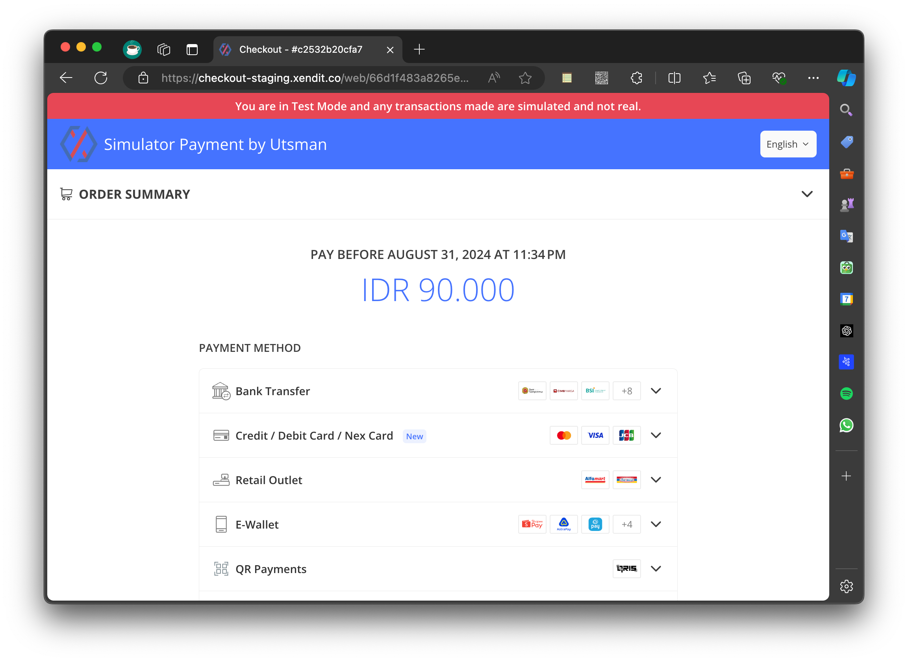
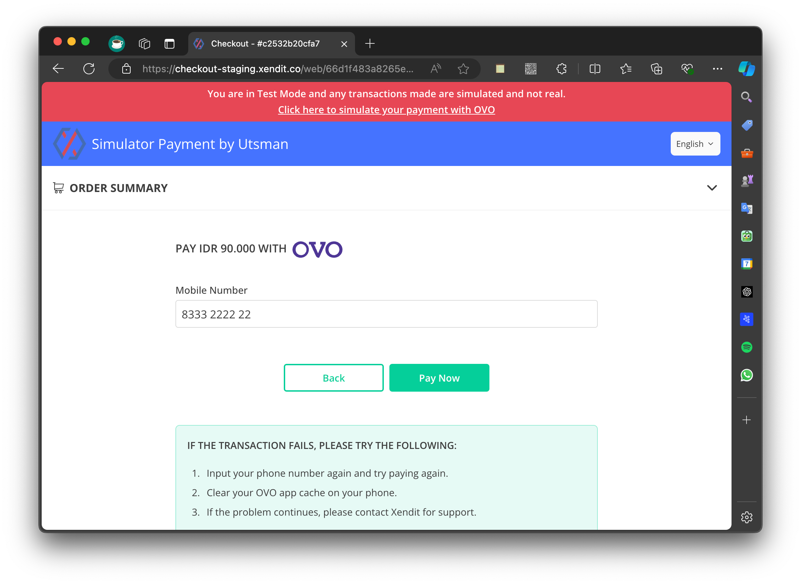

In this API, the "payment" for top-up balance is a Fake Payment using the Xendit Test Environment. This Fake Payment can
be used to test and validate the top-up flow without executing a real transaction. Here’s a specific explanation:

### Top-Up Balance API

In the top-up balance API, a "fake payment" allows developers to send a top-up request using a simulated
payment method. Although this request is processed by the API just like a real top-up request, no actual money is
transferred, and the transaction is not continued with the payment gateway.

### Key Points

**Purpose**: To enable testing of the full top-up flow, including transaction creation, validation, status updates, and
response handling, without involving real money.

**Impact**: This is only a simulation, so the user’s balance will not actually increase, and no connection to a payment
gateway is made.

In the context of using the top-up balance API with a "fake payment" method, the user needs to follow these steps to
complete the simulation:

### Simulation Steps for Fake Payment

=== "Visit the Payment URL"

    After initiating a top-up request (`POST /api/v1/topup_balance`), the response will include an invoice_url.
    The user must go to the provided `invoice_url` to simulate the payment process.

    

=== "Simulate the Payment"

    On the payment page, follow the instructions to complete the fake payment.
    After the simulated payment is completed, the page will redirect to a blank page with the message "Thank you for your
    payment".

   

=== "Check Account Balance and Invoice Status"

    After seeing the "Thank you for your payment" message, the user's account balance will be updated.
    The status of the top-up invoice will change to "PAID".
    This simulation allows the user to test the full payment flow as if it were a real transaction, ensuring that the top-up
    process is working correctly within the API.