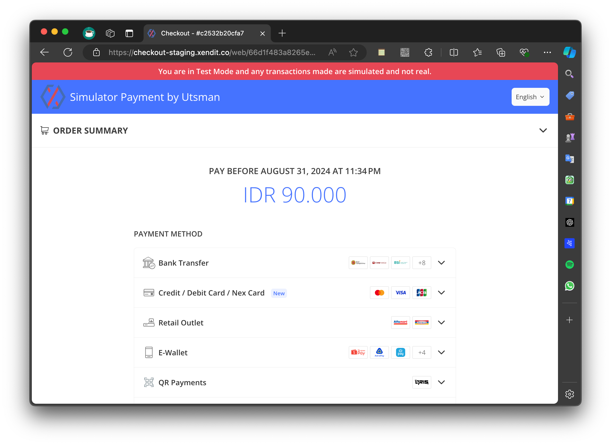
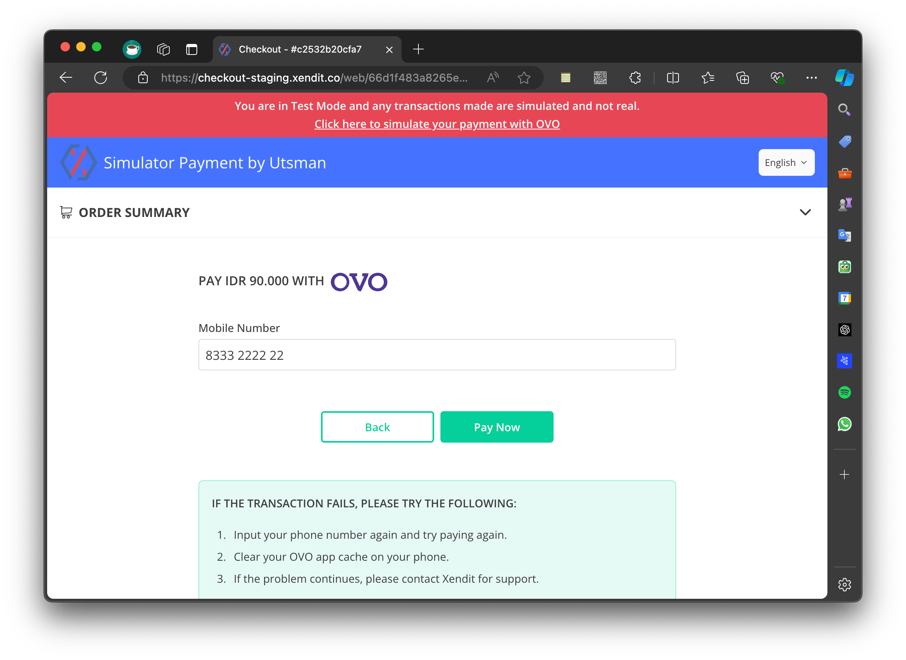

Dalam API ini, "pembayaran" untuk isi saldo adalah Pembayaran Palsu menggunakan Xendit Test Environment. Pembayaran
Palsu ini dapat digunakan untuk menguji dan memvalidasi alur isi saldo tanpa melakukan transaksi nyata. Berikut adalah
penjelasan spesifiknya:

### Top-Up Balance API

Dalam API isi saldo, "pembayaran palsu" memungkinkan pengembang untuk mengirim permintaan isi saldo menggunakan metode
pembayaran yang disimulasikan. Meskipun permintaan ini diproses oleh API seperti permintaan isi saldo nyata, tidak ada
uang yang benar-benar ditransfer, dan transaksi tidak dilanjutkan dengan gateway pembayaran.

### Key Points

**Purpose**: Memungkinkan pengujian alur isi saldo penuh, termasuk pembuatan transaksi, validasi, pembaruan status, dan
penanganan tanggapan, tanpa melibatkan uang nyata.

**Impact**: Ini hanyalah simulasi, sehingga saldo pengguna sebenarnya tidak akan bertambah, dan tidak ada koneksi yang
dibuat ke gateway pembayaran.

### Simulation Steps for Fake Payment

=== "Kunjungi URL Pembayaran"

    Setelah memulai permintaan top-up (`POST /api/v1/topup_balance`), respons akan menyertakan invoice_url.
    Pengguna harus mengunjungi `invoice_url` yang diberikan untuk mensimulasikan proses pembayaran.

    

=== "Simulasikan Pembayaran"

    Di halaman pembayaran, ikuti instruksi untuk menyelesaikan pembayaran palsu.
    Setelah pembayaran simulasi selesai, halaman akan mengarahkan ke halaman kosong dengan pesan "Thank you for your
    payment".

     

=== "Periksa Saldo Akun dan Status Invoice"

    Setelah melihat pesan "Thank you for your payment", saldo akun pengguna akan diperbarui.
    Status faktur top-up akan berubah menjadi "PAID".
    Simulasi ini memungkinkan pengguna untuk menguji alur pembayaran penuh seolah-olah itu adalah transaksi nyata, memastikan bahwa proses top-up berfungsi dengan benar di dalam API.
