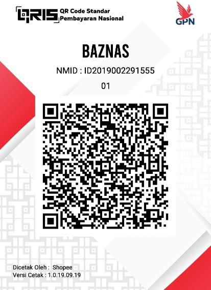

Before you make a transaction using QRIS on the <span style="color:#C75151">**POST**</span> **`/api/v1/transaction/qris`**
endpoint,
Maybe you need to translate the QRIS code into information to be displayed in your application. That's what I'm for
provides a dedicated endpoint and is independent of versioning `/api/v1/`.

## EndPoint for Get Information

<span style="color:#C75151">**GET**</span> **`/qris`**

- **Summary:** Non authentication request for parse QRIS content to data json

???+ "Content Example"

    === "Response"
            
        ``` { .json .copy }
        {
            "message": "ok",
            "status": true,
            "data": {
                "raw": "00020101021126550016ID.CO.SHOPEE.WWW01189360091800000000180202180303UBE51440014ID.CO.QRIS.WWW0215ID20190022915550303UBE5204839853033605802ID5906Baznas6013Jakarta Pusat61051034062070703A016304A402",
                "format_indicator": "01",
                "initiation_method": "11",
                "amount": "",
                "merchant_name": "Baznas",
                "merchant_city": "Jakarta Pusat",
                "country_code": "ID",
                "postal_code": "10340",
                "merchant_account_1": {
                    "identifier": "ID.CO.SHOPEE.WWW",
                    "merchant_id": "18",
                    "merchant_pan": "936009180000000018",
                    "merchant_criteria": "UBE"
                },
                "merchant_account_2": {
                    "identifier": "ID.CO.QRIS.WWW",
                    "merchant_id": "ID2019002291555",
                    "merchant_pan": "",
                    "merchant_criteria": "UBE"
                },
                "additional_info": {
                    "reference_label": "",
                    "terminal_label": "A01",
                    "payment_system_specified_template": ""
                },
                "crc": "A402"
            }
        }
        ```

    === "Request"

        ``` { .shell .copy }
        curl --location --request GET 'https://ppob-fake-api.fly.dev/qris?content=00020101021126550016ID.CO.SHOPEE.WWW01189360091800000000180202180303UBE51440014ID.CO.QRIS.WWW0215ID20190022915550303UBE5204839853033605802ID5906Baznas6013Jakarta Pusat61051034062070703A016304A402' \
        ```

---

## QRIS Structure for Parsing and Explanation

QRIS (Quick Response Code Indonesian Standard) is a QR code standard used in Indonesia to facilitate digital payments.
The QRIS structure follows the EMVCo format, which includes various data elements parsed from the QR code. Below is the
general QRIS structure and the explanation of each element:

### 1. **Payload Format Indicator (ID 00)**

- **Format**: Two digits
- **Description**: The format version indicator, usually "01" for QRIS.

### 2. **Point of Initiation Method (ID 01)**

- **Format**: Two digits
- **Description**: The method of initiation, "11" for a static QR (used for multiple transactions) or "12" for a dynamic
  QR (used for a single transaction).

### 3. **Merchant Account Information (ID 26-51)**

- **Format**: Data structure consisting of sub-elements
- **Description**: Information related to the merchant's account, which may include several sub-elements, such as:
    - **ID 00**: Globally Unique Identifier (GUID) for the merchant.
    - **ID 01**: Merchant ID number.
    - **ID 02**: Merchant PAN (Primary Account Number).
    - **ID 03**: Specific merchant criteria.

### 4. **Merchant Category Code (ID 52)**

- **Format**: Four digits
- **Description**: The code representing the merchant's business category (e.g., 5311 for supermarkets).

### 5. **Transaction Currency (ID 53)**

- **Format**: Three digits
- **Description**: The transaction currency code, usually "360" for IDR (Indonesian Rupiah).

### 6. **Transaction Amount (ID 54)**

- **Format**: Numeric value
- **Description**: The transaction amount, which may be empty for static QR.

### 7. **Tip or Convenience Fee Indicator (ID 55)**

- **Format**: Two digits
- **Description**: The indicator for tip or service fee.

### 8. **Country Code (ID 58)**

- **Format**: Two characters
- **Description**: The country code, usually "ID" for Indonesia.

### 9. **Merchant Name (ID 59)**

- **Format**: String (alphanumeric)
- **Description**: The name of the merchant.

### 10. **Merchant City (ID 60)**

- **Format**: String (alphanumeric)
- **Description**: The city where the merchant is located.

### 11. **Postal Code (ID 61)**

- **Format**: String (alphanumeric)
- **Description**: The postal code of the merchant's location.

### 12. **Additional Data Field Template (ID 62)**

- **Format**: Data structure consisting of sub-elements
- **Description**: Additional information that may be required, such as:
    - **ID 01**: Reference label.
    - **ID 05**: Terminal label.
    - **ID 07**: User label.

### 13. **CRC (ID 63)**

- **Format**: Four hexadecimal digits
- **Description**: Cyclic Redundancy Check (CRC) for data integrity validation.

### Additional Explanation:

1. **Use of IDs and Sub-IDs**: The QRIS structure uses IDs to mark different data elements, and some elements like
   Merchant Account Information and Additional Data Field Template may have sub-IDs.

2. **Data Length**: Each ID is followed by two digits indicating the length of the data in characters, followed by the
   actual data. For example, `010211` means ID 01 (Point of Initiation Method) has 02 characters with the value "11".

3. **Parsing**: To parse QRIS, the process involves reading the ID, extracting the data length, and then capturing the
   corresponding data. The data can then be further processed or displayed as needed.

## Parsing

Parsing a QR code from QRIS involves extracting and interpreting the encoded data to retrieve meaningful information.
The process begins by reading the QR code string and breaking it down into segments. Each segment typically consists of
an identifier, length, and value.

For example, the first two characters represent the identifier (e.g., "00" for format indicator), followed by two
characters that define the length of the value, and then the actual value itself. This pattern is repeated throughout
the entire QR string.

Some segments contain nested data, such as merchant account information, which requires further parsing. In these cases,
the value of the segment is broken down similarly into sub-identifiers, lengths, and values.

Once all segments are parsed, the values are mapped to specific attributes in a data structure. This
structure might include fields like merchant name, city, amount, and additional information.

Finally, the parsed data is validated by checking specific fields, such as verifying the QRIS provider. If the data is
valid, it can then be used for processing payments or other relevant actions. This structured approach ensures that all
necessary information is correctly extracted and interpreted.

### Pseudo Code Explanation

```shell
function qris_processor(result: dict) -> QrisData:
    initialize qris_data as new QrisData object

    define mapping as dictionary with:
        "00" -> "format_indicator"
        "01" -> "initiation_method"
        "54" -> "amount"
        "59" -> "merchant_name"
        "60" -> "merchant_city"
        "58" -> "country_code"
        "61" -> "postal_code"
        "26-00" -> "merchant_account_1.identifier"
        "26-01" -> "merchant_account_1.merchant_pan"
        "26-02" -> "merchant_account_1.merchant_id"
        "26-03" -> "merchant_account_1.merchant_criteria"
        "51-00" -> "merchant_account_2.identifier"
        "51-01" -> "merchant_account_2.merchant_pan"
        "51-02" -> "merchant_account_2.merchant_id"
        "51-03" -> "merchant_account_2.merchant_criteria"
        "62-05" -> "additional_info.reference_label"
        "62-07" -> "additional_info.terminal_label"
        "62-50" -> "additional_info.payment_system_specified_template"
        "63" -> "crc"

    for each key-value pair (t, u) in result:
        if t exists in mapping:
            split the mapped attribute path into list attr_path
            set target as qris_data

            for each attribute in attr_path except the last one:
                update target to point to the corresponding attribute of target

            set the last attribute of target to value u

    return qris_data


function parse_qris(input_string: str) -> Optional[QrisData]:
    initialize index as 0
    initialize result as an empty dictionary

    while index is less than length of input_string:
        extract qr_id as substring from index to index + 2
        extract qr_id_length as substring from index + 2 to index + 4

        try to convert qr_id_length to integer qr_id_value_length:
            if conversion fails, return None

        extract qr_id_value as substring from index + 4 to index + 4 + qr_id_value_length
        store qr_id_value in result with key qr_id

        if qr_id is between 26 and 40 or in [51, 62]:
            initialize nested_index as 0

            while nested_index is less than length of qr_id_value:
                try to extract nested qr_id as substring from nested_index to nested_index + 2
                extract nqi_length as substring from nested_index + 2 to nested_index + 4
                convert nqi_length to integer nqi_value_length

                calculate nqi_value_index as nested_index + 4
                calculate nqi_value_index_offset as nested_index + 4 + nqi_value_length

                extract nqi_value as substring from nqi_value_index to nqi_value_index_offset
                store nqi_value in result with key "qr_id-nqi"

                update nested_index by adding 4 + nqi_value_length
                if any extraction or conversion fails, return None

        update index by adding 4 + qr_id_value_length

    call qris_processor with result and store the returned object in qris_data
    set raw attribute of qris_data to input_string

    if qris_data.merchant_account_2.identifier equals 'ID.CO.QRIS.WWW':
        return qris_data
    else:
        return None  # invalid QRIS provider

```

### QRIS Example:



Here's a step-by-step explanation for processing the given QRIS code:

Given QRIS input:

```
00020101021126550016ID.CO.SHOPEE.WWW01189360091800000000180202180303UBE51440014ID.CO.QRIS.WWW0215ID20190022915550303UBE5204839853033605802ID5906Baznas6013Jakarta Pusat61051034062070703A016304A402
```

### 1. Start with `parse_qris`:

- **Index** starts at `0`.
- **Result** is an empty dictionary.

### 2. Processing QRIS step by step:

#### Iteration 1:

- **qr_id**: `00` (from index `0-2`)
- **qr_id_length**: `02` (from index `2-4`)
- **qr_id_value_length**: `2`
- **qr_id_value**: `01` (from index `4-6`)
- **Result**: `{"00": "01"}`

- **Index** is now `6`.

#### Iteration 2:

- **qr_id**: `01`
- **qr_id_length**: `02`
- **qr_id_value_length**: `2`
- **qr_id_value**: `11`
- **Result**: `{"00": "01", "01": "11"}`

- **Index** is now `10`.

#### Iteration 3:

- **qr_id**: `26` (Merchant Account)
- **qr_id_length**: `55`
- **qr_id_value_length**: `55`
- **qr_id_value**: `0016ID.CO.SHOPEE.WWW01189360091800000000180202180303UBE`
- **Result**: `{"00": "01", "01": "11", "26": "0016ID.CO.SHOPEE.WWW01189360091800000000180202180303UBE"}`

- **Index** is now `69`.

**Nested Iteration within `26`:**

- **nqi**: `00`
- **nqi_length**: `16`
- **nqi_value**: `ID.CO.SHOPEE.WWW`
- **Result**:
  `{"00": "01", "01": "11", "26": "0016ID.CO.SHOPEE.WWW01189360091800000000180202180303UBE", "26-00": "ID.CO.SHOPEE.WWW"}`

- **nqi**: `01`
- **nqi_length**: `18`
- **nqi_value**: `936009180000000018`
- **Result**: `{"00": "01", "01": "11", "26-00": "ID.CO.SHOPEE.WWW", "26-01": "936009180000000018"}`

- **nqi**: `02`
- **nqi_length**: `02`
- **nqi_value**: `18`
- **Result**: `{"00": "01", "01": "11", "26-00": "ID.CO.SHOPEE.WWW", "26-01": "936009180000000018", "26-02": "18"}`

- **nqi**: `03`
- **nqi_length**: `03`
- **nqi_value**: `UBE`
- **Result**:
  `{"00": "01", "01": "11", "26-00": "ID.CO.SHOPEE.WWW", "26-01": "936009180000000018", "26-02": "18", "26-03": "UBE"}`

#### Iteration 4:

- **qr_id**: `51` (Merchant Account 2)
- **qr_id_length**: `44`
- **qr_id_value_length**: `44`
- **qr_id_value**: `0014ID.CO.QRIS.WWW0215ID20190022915550303UBE`
- **Result**:
  `{"00": "01", "01": "11", "26-00": "ID.CO.SHOPEE.WWW", "26-01": "936009180000000018", "26-02": "18", "26-03": "UBE", "51": "0014ID.CO.QRIS.WWW0215ID20190022915550303UBE"}`

- **Index** is now `117`.

**Nested Iteration within `51`:**

- **nqi**: `00`
- **nqi_length**: `14`
- **nqi_value**: `ID.CO.QRIS.WWW`
- **Result**:
  `{"00": "01", "01": "11", "26-00": "ID.CO.SHOPEE.WWW", "26-01": "936009180000000018", "26-02": "18", "26-03": "UBE", "51-00": "ID.CO.QRIS.WWW"}`

- **nqi**: `02`
- **nqi_length**: `15`
- **nqi_value**: `ID2019002291555`
- **Result**:
  `{"00": "01", "01": "11", "26-00": "ID.CO.SHOPEE.WWW", "26-01": "936009180000000018", "26-02": "18", "26-03": "UBE", "51-00": "ID.CO.QRIS.WWW", "51-02": "ID2019002291555"}`

- **nqi**: `03`
- **nqi_length**: `03`
- **nqi_value**: `UBE`
- **Result**:
  `{"00": "01", "01": "11", "26-00": "ID.CO.SHOPEE.WWW", "26-01": "936009180000000018", "26-02": "18", "26-03": "UBE", "51-00": "ID.CO.QRIS.WWW", "51-02": "ID2019002291555", "51-03": "UBE"}`

#### Iteration 5:

- **qr_id**: `52`
- **qr_id_length**: `04`
- **qr_id_value_length**: `4`
- **qr_id_value**: `8398`
- **Result**:
  `{"00": "01", "01": "11", "26-00": "ID.CO.SHOPEE.WWW", "26-01": "936009180000000018", "26-02": "18", "26-03": "UBE", "51-00": "ID.CO.QRIS.WWW", "51-02": "ID2019002291555", "51-03": "UBE", "52": "8398"}`

- **Index** is now `127`.

#### Iteration 6:

- **qr_id**: `53`
- **qr_id_length**: `03`
- **qr_id_value_length**: `3`
- **qr_id_value**: `360`
- **Result**:
  `{"00": "01", "01": "11", "26-00": "ID.CO.SHOPEE.WWW", "26-01": "936009180000000018", "26-02": "18", "26-03": "UBE", "51-00": "ID.CO.QRIS.WWW", "51-02": "ID2019002291555", "51-03": "UBE", "52": "8398", "53": "360"}`

- **Index** is now `134`.

#### Iteration 7:

- **qr_id**: `58`
- **qr_id_length**: `02`
- **qr_id_value_length**: `2`
- **qr_id_value**: `ID`
- **Result**:
  `{"00": "01", "01": "11", "26-00": "ID.CO.SHOPEE.WWW", "26-01": "936009180000000018", "26-02": "18", "26-03": "UBE", "51-00": "ID.CO.QRIS.WWW", "51-02": "ID2019002291555", "51-03": "UBE", "52": "8398", "53": "360", "58": "ID"}`

- **Index** is now `138`.

#### Iteration 8:

- **qr_id**: `59`
- **qr_id_length**: `06`
- **qr_id_value_length**: `6`
- **qr_id_value**: `Baznas`
- **Result**:
  `{"00": "01", "01": "11", "26-00": "ID.CO.SHOPEE.WWW", "26-01": "936009180000000018", "26-02": "18", "26-03": "UBE", "51-00": "ID.CO.QRIS.WWW", "51-02": "ID2019002291555", "51-03": "UBE", "52": "8398", "53": "360", "58": "ID", "59": "Baznas"}`

- **Index** is now `148`.

#### Iteration 9:

- **qr_id**: `60`


- **qr_id_length**: `13`
- **qr_id_value_length**: `13`
- **qr_id_value**: `Jakarta Pusat`
- **Result**:
  `{"00": "01", "01": "11", "26-00": "ID.CO.SHOPEE.WWW", "26-01": "936009180000000018", "26-02": "18", "26-03": "UBE", "51-00": "ID.CO.QRIS.WWW", "51-02": "ID2019002291555", "51-03": "UBE", "52": "8398", "53": "360", "58": "ID", "59": "Baznas", "60": "Jakarta Pusat"}`

- **Index** is now `165`.

#### Iteration 10:

- **qr_id**: `61`
- **qr_id_length**: `05`
- **qr_id_value_length**: `5`
- **qr_id_value**: `10340`
- **Result**:
  `{"00": "01", "01": "11", "26-00": "ID.CO.SHOPEE.WWW", "26-01": "936009180000000018", "26-02": "18", "26-03": "UBE", "51-00": "ID.CO.QRIS.WWW", "51-02": "ID2019002291555", "51-03": "UBE", "52": "8398", "53": "360", "58": "ID", "59": "Baznas", "60": "Jakarta Pusat", "61": "10340"}`

- **Index** is now `174`.

#### Iteration 11:

- **qr_id**: `62` (Additional Info)
- **qr_id_length**: `07`
- **qr_id_value_length**: `7`
- **qr_id_value**: `03A0163`
- **Result**:
  `{"00": "01", "01": "11", "26-00": "ID.CO.SHOPEE.WWW", "26-01": "936009180000000018", "26-02": "18", "26-03": "UBE", "51-00": "ID.CO.QRIS.WWW", "51-02": "ID2019002291555", "51-03": "UBE", "52": "8398", "53": "360", "58": "ID", "59": "Baznas", "60": "Jakarta Pusat", "61": "10340", "62": "03A0163"}`

- **Index** is now `183`.

#### Iteration 12:

- **qr_id**: `63`
- **qr_id_length**: `04`
- **qr_id_value_length**: `4`
- **qr_id_value**: `A402`
- **Result**:
  `{"00": "01", "01": "11", "26-00": "ID.CO.SHOPEE.WWW", "26-01": "936009180000000018", "26-02": "18", "26-03": "UBE", "51-00": "ID.CO.QRIS.WWW", "51-02": "ID2019002291555", "51-03": "UBE", "52": "8398", "53": "360", "58": "ID", "59": "Baznas", "60": "Jakarta Pusat", "61": "10340", "62-07": "03A0163", "63": "A402"}`

- **Index** is now `191`, which is the end of the input string.

### 3. Call `qris_processor`

- After all data is parsed, `qris_processor` maps the data from `Result` to the attributes in `QrisData`.
- **Raw** in `qris_data` is set with the `input_string`.

### 4. Validate QRIS:

- Check if `merchant_account_2.identifier` is equal to `'ID.CO.QRIS.WWW'`.
- If true, return `qris_data`.
- If false, return `None`.

### 5. Final Output

- Based on the example, the QRIS data is valid, and the processed `qris_data` will be returned, containing complete
  information such as `merchant_name` (`Baznas`), `merchant_city` (`Jakarta Pusat`), `amount`, and others according to
  the parsed result.

---

## Core reference

[utsmannn/qris_parser.py](https://gist.github.com/utsmannn/06ef96e12237ff622de687d5b582630f)